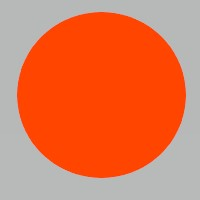

# TempoAqui 🌦️

Uma aplicação web moderna e elegante para consulta de previsão do tempo, oferecendo informações meteorológicas precisas e atualizadas para qualquer cidade do mundo.

## ✨ Características

- 🔍 Pesquisa intuitiva por cidade
- 🌡️ Dados meteorológicos em tempo real
- 📊 Gráfico interativo de temperatura
- 🗓️ Previsão para 5 dias
- 🌓 Tema claro/escuro
- 📱 Design responsivo
- ⚡ Loading states com Skeleton
- 💫 Animações suaves
- 🎨 Interface moderna com Material-UI

## 🛠️ Tecnologias

- **React** - Biblioteca JavaScript para construção de interfaces
- **Material-UI** - Framework de design para React
- **Chart.js** - Biblioteca para criação de gráficos
- **OpenWeather API** - API de dados meteorológicos
- **Vite** - Build tool e bundler

## 🚀 Começando

### Pré-requisitos

- Node.js (versão 14 ou superior)
- npm ou yarn

### Instalação

1. Clone o repositório

2. Entre no diretório

3. Instale as dependências

4. Configure as variáveis de ambiente

5. Inicie o servidor de desenvolvimento

## 🎯 Principais Componentes

### Header
- Logo animado
- Navegação principal
- Alternador de tema

### WeatherSearch
- Campo de busca com autocompletar
- Validação de entrada
- Loading state

### CurrentWeather
- Temperatura atual
- Condições meteorológicas
- Detalhes adicionais (umidade, vento, etc.)

### WeatherChart
- Gráfico de temperatura para 5 dias
- Interativo e responsivo
- Customizado para tema claro/escuro

### ForecastList
- Previsão detalhada para 5 dias
- Cards informativos
- Ícones dinâmicos

## 🌐 API

O projeto utiliza a OpenWeather API com dois endpoints principais:

- Current Weather Data
- 5 Day / 3 Hour Forecast

## 🤝 Contribuindo

1. Fork o projeto
2. Crie sua Feature Branch (`git checkout -b feature/MinhaFeature`)
3. Commit suas mudanças (`git commit -m 'Adiciona MinhaFeature'`)
4. Push para a Branch (`git push origin feature/MinhaFeature`)
5. Abra um Pull Request

## 📄 Licença

Este projeto está sob a licença MIT - veja o arquivo [LICENSE](LICENSE) para detalhes.

## 👤 Autor

**emers0n17**
- GitHub: [@emers0n17](https://github.com/emers0n17)
- LinkedIn: [Emerson Silva](https://linkedin.com)

## 🙏 Agradecimentos

- OpenWeather pela API
- Material-UI pela biblioteca de componentes
- Claude 3.5 Sonnet pela assistência no desenvolvimento

## 🎨 Design

O projeto utiliza uma paleta de cores moderna e acessível:
- Primária: `#00B4D8`
- Secundária: `#4ECDC4`
- Accent: `#FF6B6B`
- Background (Light): `#F8F9FA`
- Background (Dark): `#212529`

---

Desenvolvido com ❤️ por emers0n17
